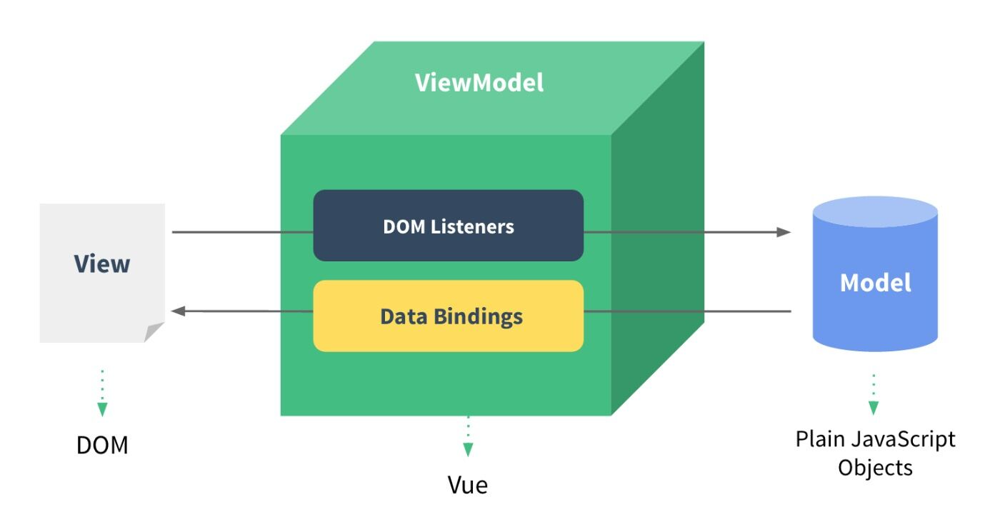

[TOC]

## 数组的常用方法：
### 1.forEach
 forEach没有返回值，不能跳出循环 for循环可以跳出循环
### 2.map
map 映射 讲一个数组映射成一个新数组,返回什么就会把当前返回的放到一个新数组中
```
let newArr = ['我','很','帅'].map((item,index)=>`<li>${item}<li>`);
```
### 3.filter
filter 过滤 返回值是一个过滤后的数组，如果回调函数中返回true 表示放到新数组中，返回false 表示过滤掉
```
let newArr = [1,2,3,4,5].filter((item,index)=>item!==3);
```
### 4.find 
find 查找找到是数组中某一项，如果找不到返回undefined,find找到一次后就停止
```
let item = [1,2,3].find(item=>item===3);
```
### 5.includes some every
includes some every 判断数组中有没有 返回boolean类型
```
console.log([1,2,3].includes(3));
console.log([1,2,3].some(item=>item>3));//找true
console.log([1,4,3].every(item=>item>3));//找false 找到后就返回不继续查找
```
### 6.reduce
 reduce回调函数中有几个参数 收敛 返回一个叠加后的结果
```
let sum = [0,{count:1,price:2},{count:2,price:3},{count:2,price:3}].reduce(function (prev,current,index,oldArr) { //参数个数4
    console.log(prev,current);
    return prev+current.count*current.price;
},0);//0指的是第一项 相当于在数组前面增加了一项
console.log(sum);
```
```
let flat = [[1,2],[3,4],[5,8]].reduce((prev,next)=>prev.concat(next));
console.log(flat);
```

## VUE部分
### 什么是vue？
Vue.js（读音 /vju?/，类似于 view） 是一套构建用户界面的渐进式框架。与其他重量级框架不同的是，Vue 采用自底向上增量开发的设计。Vue 的核心库只关注视图层，它不仅易于上手，还便于与第三方库或既有项目整合。另一方面，当与单文件组件和 Vue 生态系统支持的库结合使用时，Vue 也完全能够为复杂的单页应用程序提供驱动。
### MVC  MVVM
 
 MVC   controller -> model -> view
 MVVM model view viewModel
 MVVM模式只针对可以编辑可改变的元素 input textarea
数据驱动视图  视图可以改变数据
### vue基础
#### 指令
指令是一种特殊自定义行间属性，在Vue中，指令以v-开头

#### 双向数据绑定v-model
```
<input type="text" v-model="message">
```
#### 
> 当你改变数据上的属性，视图也会随之变化。相反视图变化也会影响数据
#### 表达式
插值表达式，使用Mustache语法(双大括号)
```
{{message=="hello,vue.js"?"yes":"no"}}
<div v-text="hello,vue.js"?"yes":"no"></div>
```  
#### v-once/v-html/v-text/v-cloak 
- 有时候我们想让数据只绑定一次,当数据在更改时不会更新内容(v-once)v-once里面的内容 不会再次监控数据的变化
```
<div v-once>{{msg}}</div>
```
- 当绑定的数据是html字符串时，展示成正常的html(v-html)
```
 <div v-html="msg"></div>
```
- v-text和{{}}是等价的 属性是不会被用户看到的，编译好后再插入到div中 可以解决局部闪烁问题
```
<div v-text="msg"></div>
- v-cloak 解决闪烁问题
```
####  v-for循环
循环数组时循环的顺序是value,index
循环对象属性时的顺序是value,key
- 属性如果没有声明 则不能取
-  如果对象中没有此属性后加的，则不支持数据绑定的，数据改变视图也不会刷新
- 可以用新的属性替换掉老的可以实现后添加属性,$set也可以实现后添加属性 vm.$set(vm.a,'a',1)
``` 
<li v-for="(val,key) in school">{{val}} {{key}}</li>
```
#### v-on事件
- v-on:click简写@click
- 执行方法时加上()事件源默认不传递，需要手动传入$event
- methods中的this永远指向Vue的实例
```
<button v-on:click="addFruit">按钮</button>
<ul>
  <li v-for="value in fruits" >
     {{value}}
  </li>
</ul>
var vue = new Vue({
  el:'#box',
  data:{
      fruits:['香蕉','苹果','橘子']
  },
  methods:{
      addFruit(){
          this.fruits.push('苹果');
      }
  }
});
```
####  v-if/v-show
v-show 如果为false时通过css样式将元素隐藏
``` 
<div v-show='false'>jw,handsome</div>
```
v-if 如果为false时移除DOM节点
```
<div v-if='false'>jw,handsome</div>
```
> v-if后面可以根v-else-if或者v-else
#### 事件进阶-修饰符
事件后面可以加一些常用的“修饰符” keyup.enter
阻止冒泡 阻止默认事件 只在自己身上触发  事件捕获
事件的行文默认是冒泡 从内往外
-  .stop  代表阻止冒泡
-  .capture 表示事件捕获 先捕获 -> 在到目标 -> 在到冒泡
-  .self 表示只在自己身上触发
-  .prevent 阻止默认事件
- .键盘事件  修饰符可以连续调用
> 事件处理函数只有纯粹的逻辑判断，不处理DOM事件的细节
例如: 阻止冒泡、默认行为、判断按键
```
<div id="app">
    <div @click="parent">parent
        <div @click.self.stop="son">son
            <div @click="grandson">grandson</div>
        </div>
    </div>
    <a href="http://www.baidu.com" @click.prevent>去百度</a>
</div>

let vm = new Vue({
        el:'#app',
        methods:{
            grandson(){
                alert('grandson')
            },
            son(){
                alert('son');
            },
            parent(){
                alert('parent')
            }
        }
  })
```
#### v-bind绑定动态属性
- {{}}取值表达式 一般只用在html标签内
- v-bind可以简写成:的形式 如果以后数据需要使用动态绑定则使用:的形式
```
<div :title="msg">我好帅</div>

```
##### :class绑定style
- class style可以动态绑定 写法比较特殊 可以使用对象和数组
- 动态和静态是哪个生效是根据前后顺序，看的的是权重
```
//对象
<div :class="{back2:flag}" class="back1">vue</div>//第一个生效
//数组
<!--数组中表示两个都生效,可以再数组中使用变量-->
<div :class="['red','back2']">哈哈</div>
```
##### :style绑定行内样式
```
//对象
<div :style="{fontSize:'40px',backgroundColor:'yellowgreen'}">行内样式</div>
//数组
<div :style="[{color:'red'},{background:'orange'}]">行内</div>
<div :class="{true:'red',false:'back1'}[flag]">三元</div>
```
#### 计算属性
- computed 看起来是函数 其实是属性，method表示的就是点击触发的事件，一个封装好的函数 {{total()}}一般会用computed替换掉
- 计算 获取 根据别人的值计算而来的 设置 当给这个值赋值可能影响其他人 getter setter  axios 获取数据 默认不会挂载载实例上,前后端通用
```
<div id="app">
      <input type="checkbox" v-model="checkAll" > <br>
      <input type="checkbox" v-for="a in checkList" v-model="a.selected">
</div>

  data:{
       checkList:[{selected:true},{selected:true},{selected:false}]
  },
  computed:{
   checkAll:{
       set(val){
           for(var arr of this.checkList){
               arr.selected = val;
           }
       },
       get(){
           var obj = this.checkList.find(function (item) {
               return !item.selected
           });
           return obj?false:true;
       }
   }
  }
```
> 计算属性简单来说，就是根据数据推算出来的值，当给这个值赋值时可以影响其他值的变化。
#### watch监控
- 和computed不同,watch可以夹杂异步逻辑
- 当一个值变化时,执行某个动作用watch更加方便

```
<div id="app">
    <button @click="msg='你很帅'">你很帅</button>
    <button @click="msg='你很美'">你很美</button>
</div>
<script>
    //当一个值变化了 我就弹出一句话
    let vm = new Vue({
        el:'#app',
        data:{
            msg:'很handsome'
        },
        // 当数据变了 我就存到localStorage中
        watch:{ //监控观察 简单值变了就干一些事情 支持异步 因为没有返回值
           msg(){ //只要msg值发生了变化 就会触发此函数
               localStorage.setItem('aaa',this.msg);
           }
        }
        //watch,computed method 谈谈你的理解
    });
</script>
```

#### 生命周期
- vue在组件中的每个环节都提供了钩子函数(生老病死)
- 当调用vm.$mount()挂载后执行挂载数据
- 当调用vm.$destroy()后执行删除实例

```
// 钩子函数
    let vm = new Vue({
        data:{msg:'hello'},
        //template只能有一个根元素，而且不能是文本
        template:'<div><p>{{msg}}</p></div>',
        beforeCreate(){ //创建之前，一般不使用
            alert('beforeCreate')
        },//数据没有被挂载 方法也没有挂载
        created(){ //发送ajax请求，请求是异步的，会直接走到beforeMount中
            alert('created');
        },
        // 判断有没有el属性，看有没有template,有就用template没有就用id=app内部元素渲染
        beforeMount(){ //用不到 没有实际意义;
            alert('beforeMount')
        },
        mounted(){//获取真实dom元素 this.$refs.ok
            alert('mounted');
        },
        beforeUpdate(){ //当页面上的数据发生变化会执行此方法，前提是页面用到了这个数据
            alert('beforeUpdate')
        },
        updated(){
            alert('updated')
        },
        beforeDestroy(){
            alert('beforeDestroy')
        },
        destroyed(){
            alert('destroyed');
        }
    });
    //常用的有 created mounted beforeDestroy
    vm.$mount('#app');//挂载元素 手动挂载
    vm.$destroy(); //你去死吧,一般不会手动调用
```
> ref的作用是给一个元素添加一个别名 可以再this.$refs上拿到这个元素
```
<div ref="ok">你好</div>
```
#### 异步编程解决方案：callBack-->promise-->async await
- callBack
> 异步编程) 回调函数 将后续的逻辑做为参数传递给函数
> 回调函数需要手动传入回调
```
function read(cb) {
    setTimeout(()=>{
        let str = 'hello';
        cb(str);
    },3000);
}
//一个文件内存放的是1.txt 去读1.txt 放的是2.txt
read(function (str) {
    console.log(str);
});
```
- promise
- 只有promise的实例上才有then方法Promise.prototype.then
- then方法作用是为Promise实例添加状态改变时的回调函数
第一个参数是Resolved状态的回调函数，第二个参数（可选）是Rejected状态的回调函数。
- promise是异步编程的一种解决方式，简单说就是一个容器，里面保存着某个未来才会结束的事件（通常是一个异步操作）的结果。
- 特点：
对象状态不受外界的影响
一旦状态改变就不会再变，任何时候都能得到这个结果
一旦建立立即执行，无法取消。
```
function read() {
    //executor 执行器
    //resolve,reject 函数类型
    //resolve就是then中对应的第一个函数
    //reject 就是then中对应的第二个函数
    return new Promise(function (resolve,reject) {
        setTimeout(function () {
            let str = 'hello';
            resolve(str); //成功时将结果传入到then的回调函数中
        },3000)
    });
}
//只有promise的实例上才有then方法
read().then(function (data) {
    console.log(1,data);
},function (data) {
    console.log(data);
});
```
> promise实例（抛硬币决定七夕节给不给女朋友买礼物）
```
function buyPack() {
    return new Promise((resolve,reject)=>{
       setTimeout(()=>{
           if(Math.random()>0.5){
               resolve('买')
           }else{
               reject('不买');
           }
       },Math.random()*10*1000);
    });
}
buyPack().then((data)=>{
    console.log(data)},
(err)=>{
    console.log(err);
});
```